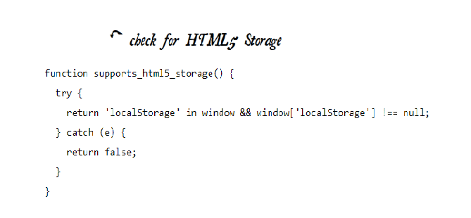
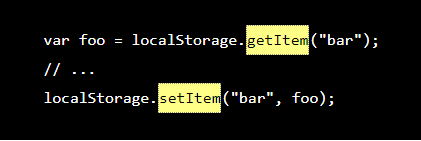
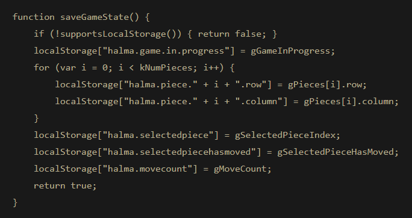

# Class 13

## HTML5 STORAGE
* ### DIVING IN
**ersistent local storage is one of the areas where native client applications have held an advantage over web applications. For native applications, the operating system typically provides an abstraction layer for storing and retrieving application-specific data like preferences or runtime state. These values may be stored in the registry, INI files, XML files, or some other place according to platform convention. If your native client application needs local storage beyond key/value pairs, you can embed your own database, invent your own file format, or any number of other solutions.**

What we really want is

* * a lot of storage space
* * on the client
* * that persists beyond a page refresh
* * and isn’t transmitted to the server

* ### A BRIEF HISTORY OF LOCAL STORAGE HACKS

**In the beginning, there was only Internet Explorer. Or at least, that’s what Microsoft wanted the world to think. To that end, as part of the First Great Browser Wars, Microsoft invented a great many things and included them in their browser-to-end-all-browser-wars, Internet Explorer. One of these things was called DHTML Behaviors, and one of these behaviors was called userData.**

In 2002, Adobe introduced a feature in Flash 6 that gained the unfortunate and misleading name of “Flash cookies.” Within the Flash environment, the feature is properly known as Local Shared Objects. Briefly, it allows Flash objects to store up to 100 KB of data per domain. Brad Neuberg developed an early prototype of a Flash-to-JavaScript bridge called AMASS (AJAX Massive Storage System), but it was limited by some of Flash’s design quirks. By 2006, with the advent of ExternalInterface in Flash 8, accessing LSOs from JavaScript became an order of magnitude easier and faster. Brad rewrote AMASS and integrated it into the popular Dojo Toolkit under the moniker dojox.storage. Flash gives each domain 100 KB of storage “for free.” Beyond that, it prompts the user for each order of magnitude increase in data storage (1 Mb, 10 Mb, and so on).

* ### INTRODUCING HTML5 STORAGE
What I will refer to as “HTML5 Storage” is a specification named Web Storage, which was at one time part of the HTML5 specification proper, but was split out into its own specification for uninteresting political reasons. Certain browser vendors also refer to it as “Local Storage” or “DOM Storage.” The naming situation is made even more complicated by some related, similarly-named, emerging standards that I’ll discuss later in this chapter.

So what is HTML5 Storage? Simply put, it’s a way for web pages to store named key/value pairs locally, within the client web browser. Like cookies, this data persists even after you navigate away from the web site, close your browser tab, exit your browser, or what have you. Unlike cookies, this data is never transmitted to the remote web server (unless you go out of your way to send it manually). Unlike all previous attempts at providing persistent local storage, it is implemented natively in web browsers, so it is available even when third-party browser plugins are not.

* ### USING HTML5 STORAGE

HTML5 Storage is based on named key/value pairs. You store data based on a named key, then you can retrieve that data with the same key. The named key is a string. The data can be any type supported by JavaScript, including strings, Booleans, integers, or floats. However, the data is actually stored as a string. If you are storing and retrieving anything other than strings, you will need to use functions like parseInt() or parseFloat() to coerce your retrieved data into the expected JavaScript datatype.

Calling setItem() with a named key that already exists will silently overwrite the previous value. Calling getItem() with a non-existent key will return null rather than throw an exception.

Like other JavaScript objects, you can treat the localStorage object as an associative array. Instead of using the getItem() and setItem() methods, you can simply use square brackets. For example, this snippet of code:

* ### HTML5 STORAGE IN ACTION
**Let’s see HTML5 Storage in action. Recall the Halma game we constructed in the canvas chapter. There’s a small problem with the game: if you close the browser window mid-game, you’ll lose your progress. But with HTML5 Storage, we can save the progress locally, within the browser itself. Here is a live demonstration. Make a few moves, then close the browser tab, then re-open it. If your browser supports HTML5 Storage, the demonstration page should magically remember your exact position within the game, including the number of moves you’ve made, the position of each of the pieces on the board, and even whether a particular piece is selected.**

