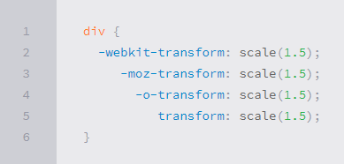
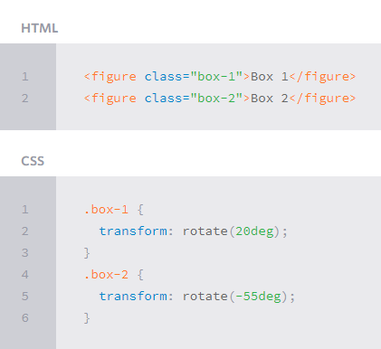
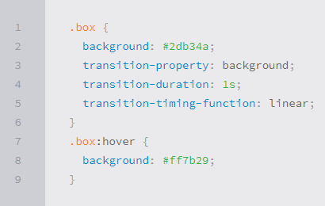

# Class 14 A
* ## [What Google Learned From Its Quest to Build the Perfect Team](https://alkhateeb49.github.io/reading-notes-201/class-14b)

* ## CSS Transforms
**With CSS3 came new ways to position and alter elements. Now general layout techniques can be revisited with alternative ways to size, position, and change elements. All of these new techniques are made possible by the transform property.**

**The transform property comes in two different settings, two-dimensional and three-dimensional. Each of these come with their own individual properties and values.**

**Within this lesson we’ll take a look at both two-dimensional and three-dimensional transforms. Generally speaking, browser support for the transform property isn’t great, but it is getting better every day. For the best support vendor prefixes are encouraged, however you may need to download the nightly version of Chrome to see all of these transforms in action.**

* * Transform Syntax
The actual syntax for the transform property is quite simple, including the transform property followed by the value. The value specifies the transform type followed by a specific amount inside parentheses.

* * 2D Transforms
Elements may be distorted, or transformed, on both a two-dimensional plane or a three-dimensional plane. Two-dimensional transforms work on the x and y axes, known as horizontal and vertical axes. Three-dimensional transforms work on both the x and y axes, as well as the z axis. These three-dimensional transforms help define not only the length and width of an element, but also the depth. We’ll start by discussing how to transform elements on a two-dimensional plane, and then work our way into three-dimensional transforms.

* * Combining Transforms
It is common for multiple transforms to be used at once, rotating and scaling the size of an element at the same time for example. In this event multiple transforms can be combined together. To combine transforms, list the transform values within the transform property one after the other without the use of commas.
Using multiple transform declarations will not work, as each declaration will overwrite the one above it. The behavior in that case would be the same as if you were to set the height of an element numerous times.

* ## CSS Transitions & Animations
One evolution with CSS3 was the ability to write behaviors for transitions and animations. Front end developers have been asking for the ability to design these interactions within HTML and CSS, without the use of JavaScript or Flash, for years. Now their wish has come true.

With CSS3 transitions you have the potential to alter the appearance and behavior of an element whenever a state change occurs, such as when it is hovered over, focused on, active, or targeted.

Animations within CSS3 allow the appearance and behavior of an element to be altered in multiple keyframes. Transitions provide a change from one state to another, while animations can set multiple points of transition upon different keyframes.

* ## 8 simple CSS3 transitions that will wow you users
* * Fade in  Having things fade in is a fairly common request from clients. It’s a great way to emphasize functionality or draw attention to a call to action.

* * Change color  Animating a change of color used to be unbelievably complex, with all kinds of math involved in calculating separate RGB values and then recombining them.

* * Grow & Shrink  To grow an element, you used to have to use its width and height, or its padding. But now we can use CSS3’s transform to enlarge.

* * Rotate elements  CSS transforms have a number of different uses, and one of the best is transforming the rotation of an element.

* * Square to circle  A really popular effect at the moment is transitioning a square element into a round one, and vice versa. With CSS, it’s a simple effect to achieve, we just transition the border-radius property.

* * 3D shadow  3D shadows were frowned upon for a year or so, because they weren’t seen as compatible with flat design, which is of course nonsense, they work fantastically well to give a user feedback on their interactions and work with flat, or fake 3D interfaces.

* * Swing  Not all elements use the transition property. We can also create highly complex animations using @keyframes, animation and animation-iteration.

* * Inset border  One of the hottest button styles right now is the ghost button; a button with no background and a heavy border.

* ## 6 Buttons animated

* ## CSS3 Animations: Keyframes

* ## 404

* ## Pure CSS Bounce Animation