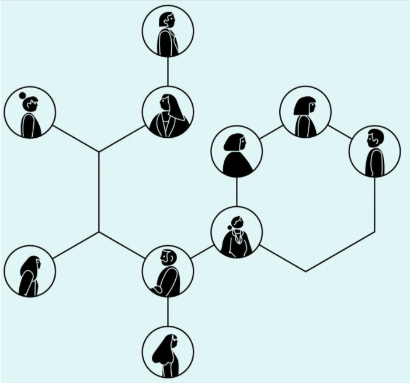
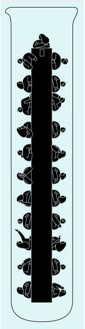

# Class 14 B

## What Google Learned From Its Quest to Build the Perfect Team

**Instead, Rozovsky’s study group was a source of stress. ‘‘I always felt like I had to prove myself,’’ she said. The team’s dynamics could put her on edge. When the group met, teammates sometimes jockeyed for the leadership position or criticized one another’s ideas. There were conflicts over who was in charge and who got to represent the group in class. ‘‘People would try to show authority by speaking louder or talking over each other,’’ Rozovsky told me. ‘‘I always felt like I had to be careful not to make mistakes around them.’’**

So Rozovsky started looking for other groups she could join. A classmate mentioned that some students were putting together teams for ‘‘case competitions,’’ contests in which participants proposed solutions to real-world business problems that were evaluated by judges, who awarded trophies and cash. The competitions were voluntary, but the work wasn’t all that different from what Rozovsky did with her study group: conducting lots of research and financial analyses, writing reports and giving presentations. The members of her case-competition team had a variety of professional experiences: Army officer, researcher at a think tank, director of a health-education nonprofit organization and consultant to a refugee program. Despite their disparate backgrounds, however, everyone clicked. They emailed one another dumb jokes and usually spent the first 10 minutes of each meeting chatting. When it came time to brainstorm, ‘‘we had lots of crazy ideas,’’ Rozovsky said.

Unlock more free articles.
Create an account or log in
One of her favorite competitions asked teams to come up with a new business to replace a student-run snack store on Yale’s campus. Rozovsky proposed a nap room and selling earplugs and eyeshades to make money. Someone else suggested filling the space with old video games. There were ideas about clothing swaps. Most of the proposals were impractical, but ‘‘we all felt like we could say anything to each other,’’ Rozovsky told me. ‘‘No one worried that the rest of the team was judging them.’’ Eventually, the team settled on a plan for a micro­gym with a handful of exercise classes and a few weight machines. They won the competition. (The micro­gym — with two stationary bicycles and three treadmills — still exists.)

Rozovsky’s study group dissolved in her second semester (it was up to the students whether they wanted to continue). Her case team, however, stuck together for the two years she was at Yale.

It always struck Rozovsky as odd that her experiences with the two groups were dissimilar. Each was composed of people who were bright and outgoing. When she talked one on one with members of her study group, the exchanges were friendly and warm. It was only when they gathered as a team that things became fraught. By contrast, her case-competition team was always fun and easygoing. In some ways, the team’s members got along better as a group than as individual friends.

‘‘I couldn’t figure out why things had turned out so different,’’ Rozovsky told me. ‘‘It didn’t seem like it had to happen that way.’’

No matter how researchers arranged the data, though, it was almost impossible to find patterns — or any evidence that the composition of a team made any difference. ‘‘We looked at 180 teams from all over the company,’’ Dubey said. ‘‘We had lots of data, but there was nothing showing that a mix of specific personality types or skills or backgrounds made any difference. The ‘who’ part of the equation didn’t seem to matter.’’

Some groups that were ranked among Google’s most effective teams, for instance, were composed of friends who socialized outside work. Others were made up of people who were basically strangers away from the conference room. Some groups sought strong managers. Others preferred a less hierarchical structure. Most confounding of all, two teams might have nearly identical makeups, with overlapping memberships, but radically different levels of effectiveness. ‘‘At Google, we’re good at finding patterns,’’ Dubey said. ‘‘There weren’t strong patterns here.’’

After looking at over a hundred groups for more than a year, Project Aristotle researchers concluded that understanding and influencing group norms were the keys to improving Google’s teams. But Rozovsky, now a lead researcher, needed to figure out which norms mattered most. Google’s research had identified dozens of behaviors that seemed important, except that sometimes the norms of one effective team contrasted sharply with those of another equally successful group. Was it better to let everyone speak as much as they wanted, or should strong leaders end meandering debates? Was it more effective for people to openly disagree with one another, or should conflicts be played down? The data didn’t offer clear verdicts. In fact, the data sometimes pointed in opposite directions. The only thing worse than not finding a pattern is finding too many of them. Which norms, Rozovsky and her colleagues wondered, were the ones that successful teams shared?

Team B is different. It’s evenly divided between successful executives and middle managers with few professional accomplishments. Teammates jump in and out of discussions. People interject and complete one another’s thoughts. When a team member abruptly changes the topic, the rest of the group follows him off the agenda. At the end of the meeting, the meeting doesn’t actually end: Everyone sits around to gossip and talk about their lives.
